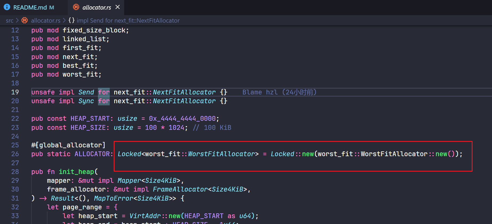

# OS! (基于 Blog OS 的模块实验创新)

| 项目       | 内容               |
|-----------|--------------------|
| 所属学校   | 合肥工业大学宣城校区   |
| 比赛方向   | 模块实验创新         |
| 队伍编号   | T202419359994461   |
| 队伍名     | OS!                |
| 队伍成员   | 王卫东、董嘉轩、胡子龙 |
| 指导老师   | 田卫东、周红鹃     |

## 对项目完成情况做一个介绍
本部分由 胡子龙 完成

完成 首次适应、循环首次适应、最佳适应、最坏适应内存分配算法

其中首次适应算法的文档在下方给出，其他算法与首次适应算法实现类似，不再赘述，作为思考题或拓展题留给读者自己思考。

算法测试使用的 main 函数位于 test_mains 文件夹下，测试对应算法需要将相应测试main文件加入src文件夹下(并改名为main.rs，已覆盖原有的main.rs)
此外，还需要将 src/allocator.rs 中的以下部分替换为对应的分配器(参考下面的图片)



## PDF文档和其他过程性材料链接
[材料1](Guidelines/Ex3.pdf)

## 代码的参考情况
[https://github.com/phil-opp/blog_os/tree/post-12](https://github.com/phil-opp/blog_os/tree/post-12)

## 运行(请按照 main 分支 Readme 中的描述搭建实验环境)

You can run the disk image in [QEMU] through:

[QEMU]: https://www.qemu.org/

```
cargo run
```

[QEMU] and the [`bootimage`] tool need to be installed for this.

## License

- MIT license ([LICENSE](LICENSE) or http://opensource.org/licenses/MIT)
