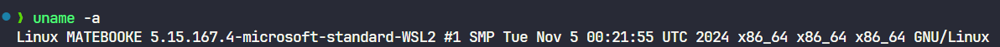
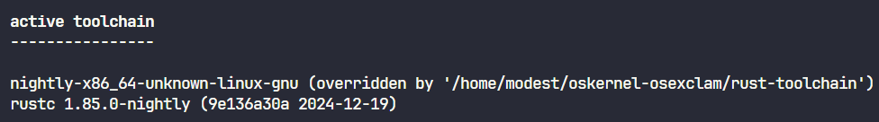
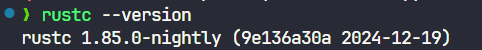
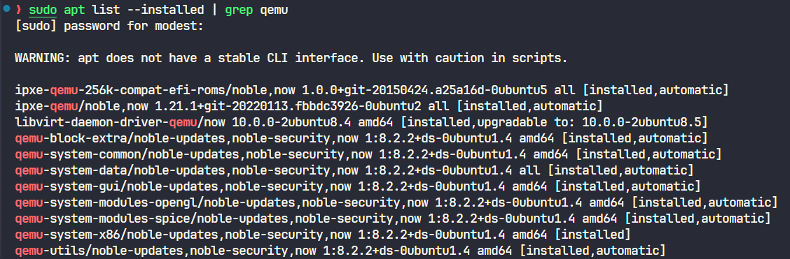

# OS! (基于 Blog OS 的模块实验创新)

## 一、队伍简介 (选题及成员等)
| 项目     | 内容                   |
| -------- | ---------------------- |
| 所属学校 | 合肥工业大学宣城校区   |
| 比赛方向 | 模块实验创新           |
| 队伍编号 | T202419359994461       |
| 队伍名   | OS!                    |
| 队伍成员 | 王卫东、董嘉轩、胡子龙 |
| 指导老师 | 田卫东、周红鹃         |

## 二、项目完成情况介绍
### 项目分别位于以下 3 个分支:
- [Ex1](https://gitlab.eduxiji.net/T202419359994461/project2608132-275359/-/tree/ex1)
- [Ex2](https://gitlab.eduxiji.net/T202419359994461/project2608132-275359/-/tree/ex2)
- [Ex3](https://gitlab.eduxiji.net/T202419359994461/project2608132-275359/-/tree/ex3)

### [1. Ex1](https://gitlab.eduxiji.net/T202419359994461/project2608132-275359/-/tree/ex1) (简单任务调度及优先队列算法)


### [2. Ex2](https://gitlab.eduxiji.net/T202419359994461/project2608132-275359/-/tree/ex2) (任务生成优化)


### [3. Ex3](https://gitlab.eduxiji.net/T202419359994461/project2608132-275359/-/tree/ex3) (常见内存分配算法)


## 三、基本实验环境 (<span style="color:red; font-weight:bold;">**其他分支中的代码运行以 main 分支中的实验环境为准**</span>)

[注] 并未使用 docker (好吧，其实是没用过)

以下为实验环境搭建过程 (能运行 以 Rust 语言编写的 OS 的实验环境应该都能运行)


### 1. Linux or WSL: Ubuntu 24.04
- 

### 2. Rust-Toolchain: nightly-2024-12-19-x86_64-unknown-linux-gnu
- 
- *!!! 请先安装rust !!!*
```
sudo apt update
sudo apt install curl wget git build-essential

curl --proto '=https' --tlsv1.2 -sSf https://sh.rustup.rs | sh
```
按照提示安装 Rust 编译器（直接默认一路回车也行）

然后执行下面的命令安装 nightly版本
```
rustup install nightly-2024-12-19-x86_64-unknown-linux-gnu
```

安装完之后，需要切换到 nightly 版本(如果已经位于项目目录下，则可以不需要执行，因为已经项目文件夹下的 rust-toolchain 文件 override 为 nightly 了)
```
rustup default nightly
# 或
# rustup override add nightly

rustc --version
```
结果应当如下：


接下来安装
```
rustup component add rust-src llvm-tools-preview rustfmt clippy

cargo install cargo-binutils cargo-xbuild bootimage
```


### 3. Qemu

```
sudo apt install qemu-system
```

## 四、测试实验
1.
2. cd到实验文件夹内
3. 执行 **cargo run**
4. 将在 qemu 中显示实验结果

[注] 如果运行时报错缺少的组件，请按照提示进行安装

## 五、PDF文档和其他过程性材料链接
- [材料1](Guidelines/Ex1.pdf)
- [材料2](Guidelines/Ex2.pdf)
- [材料3](Guidelines/Ex3.pdf)

## 六、代码的参考情况
基于 Blog OS: [https://github.com/phil-opp/blog_os/tree/post-12](https://github.com/phil-opp/blog_os/tree/post-12)

## [ *以下为 Blog OS 的 README.md 中的描述（供参考）*]
## Building

This project requires a nightly version of Rust because it uses some unstable features. At least nightly _2020-07-15_ is required for building. You might need to run `rustup update nightly --force` to update to the latest nightly even if some components such as `rustfmt` are missing it.

You can build the project by running:

```
cargo build
```

To create a bootable disk image from the compiled kernel, you need to install the [`bootimage`] tool:

[`bootimage`]: https://github.com/rust-osdev/bootimage

```
cargo install bootimage
```

After installing, you can create the bootable disk image by running:

```
cargo bootimage
```

This creates a bootable disk image in the `target/x86_64-blog_os/debug` directory.

Please file an issue if you have any problems.

## Running

You can run the disk image in [QEMU] through:

[QEMU]: https://www.qemu.org/

```
cargo run
```

[QEMU] and the [`bootimage`] tool need to be installed for this.

## Testing

To run the unit and integration tests, execute `cargo xtest`.

## License

- MIT license ([LICENSE](LICENSE) or http://opensource.org/licenses/MIT)

### Contribution
